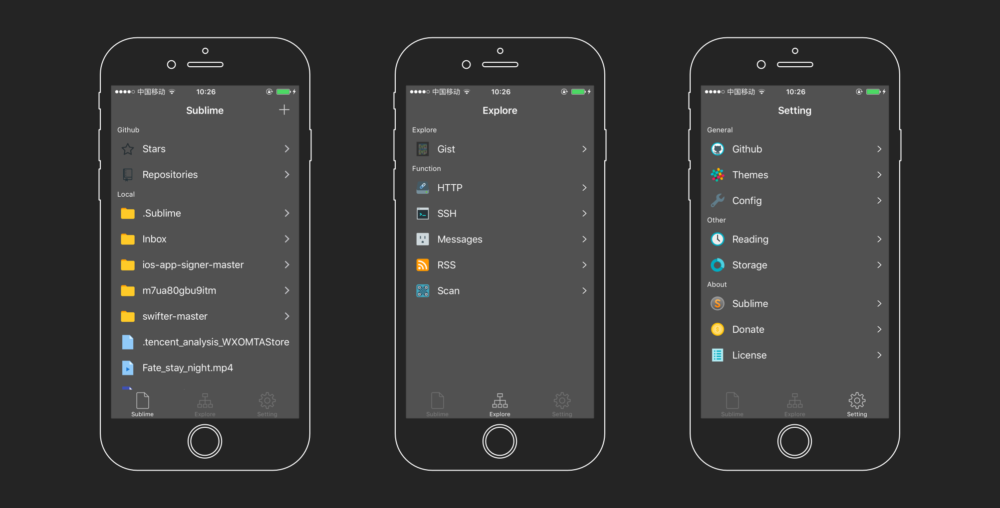
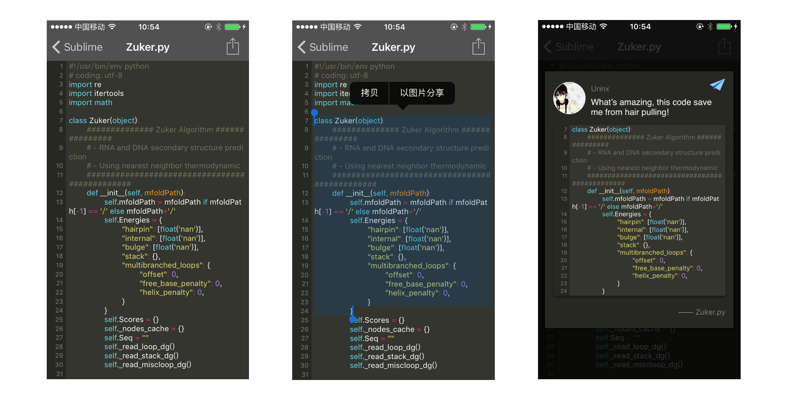
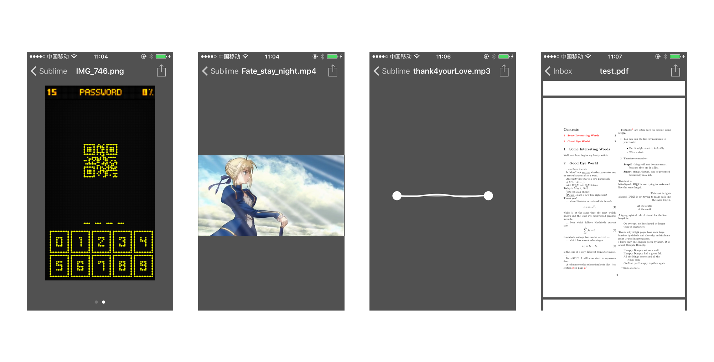
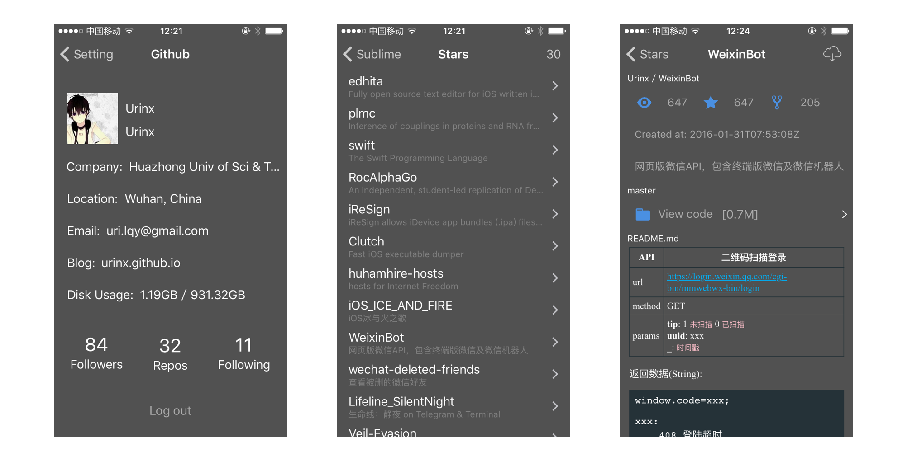
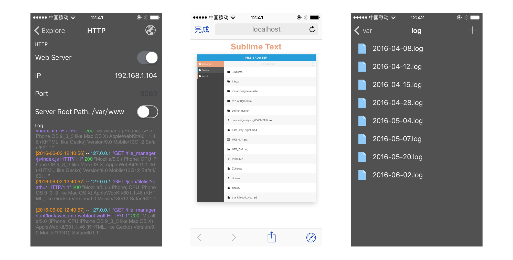
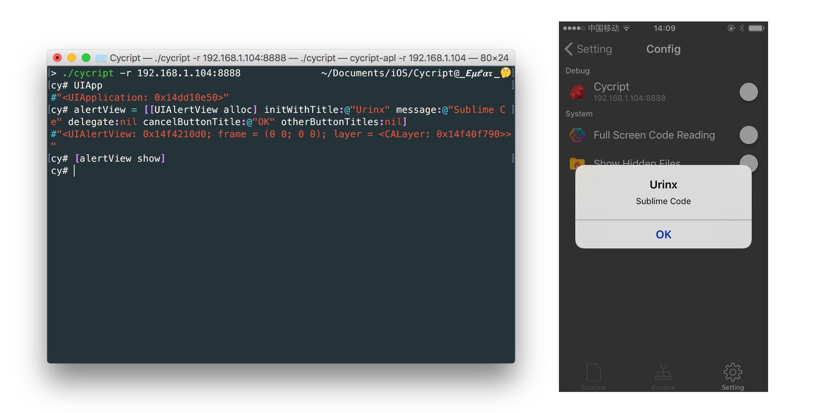
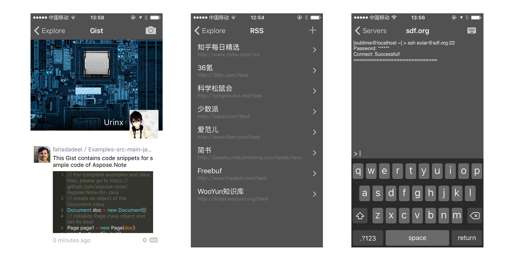

# SublimeCode     
一个代码阅读应用 - iOS

### 屏幕截图

## 功能说明

### 代码阅读
支持多种编程语言的语法高亮，全屏阅读模式，以及支持生成图片的形式分享代码到朋友圈等。

### 多种文件支持
支持查看多种格式的文件类型，包括图片，视频，音频，PDF等。

### Github支持
现在你可以在本应用里浏览Github里自己的项目和Star的项目了，也能够下载到本地离线阅读代码哟！是不是很方便呢。

### 本地HTTP服务器
还可以是一个本地HTTP服务器哦，支持Log纪录，在手机上方便的与朋友分享自己的网页。

### Cycript支持
Cycript是混合了objective-c与javascript语法的一个工具,让开发者在命令行下和应用交互，在运行时查看和修改应用。而我们的应用也集成了Cycript，是不是很酷炫呢！小伙伴们赶快来体验吧。

### 乱七八糟的功能
是的，你还可以像朋友圈一样的浏览Gist，还能SSH到自己的服务器，以及RSS订阅，与Github好友聊天，二维码扫描等等。没有做不到，只有想不到。

### 以及更多
其实里面还有超级多的功能等待着你去探索和发现，在关于页面里摇一摇还有彩蛋哟！如果你有好的想法和建议也可以告诉我们，说不定下次就加进去了呢。

### 如何安装
鉴于该应用没有上架App Store，同时也没有用企业证书签名，所以目前你只能通过以下两种方式安装，注意的是两者均需要在Mac环境下，以及安装了Xcode。推荐采取方案一的方式。

> 方案一：
> 
> 1. 下载已经build好的[ipa文件](https://github.com/Urinx/SublimeCode/releases)。
> 2. 使用Xcode新建一个项目，bundle id可以为`com.xxx.Sublime`，生成相应的证书。
> 3. 使用[iOS App Signer](https://github.com/DanTheMan827/ios-app-signer)重签名本应用，注意选择上一步生成的对应的证书。
> 4. 然后就可以使用iTunes，Xcode等各种软件将重签名后的ipa文件安装到设备上。

> 方案二：
> 
> 1. 下载本项目[源码](https://github.com/Urinx/SublimeCode/archive/v1.0.zip)。
> 2. 注意修改bundle id，再编译到设备上。
